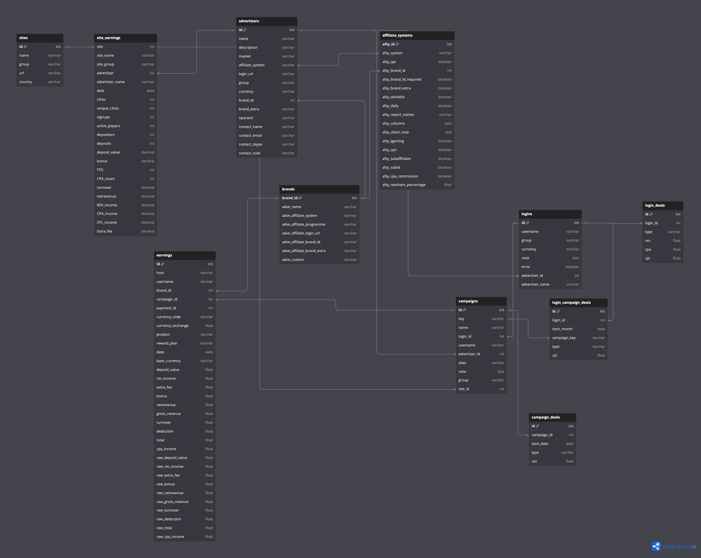

# Voonix API data utilization strategy

---

## Data Integration & Utilization

#### Quick overlook at API docs:
RESTful JSON API for affiliate marketing data
* Key entities: 
    * Advertisers - Core brand/partner accounts in affiliate ecosystem, CUD operations for managing
    * Advertiser logins/accounts - Represents credentials/accounts tied to advertisers for importing stats.
    * Campaigns - Tracks marketing campaigns.
    * Earnings/Sites - To provide performance metrics (CPL/CPA/REV and so on)

#### Data use strategy:
iGaming industry usually heavily relies on a marketing performance and affiliate partnerships, so to maximize revenue and get business insights it's very important to have an adequate process on getting this data from various data sources (Voonix API in our case)

The goal is to give stakeholders business insights on affiliate performance, so then they can do important real-time decisions to maximize profits. The data team goal is to provide everything for this needs, for example:
* Fraud detection
* Alerts and triggers if some of the campaigns is underperforming
* Periodically updated dashboards for reporting

---

## Data Storage and Utilization Approach

We're supposing that the datasets is mid-sized, and we want to get maximum efficiency from the data while ensuring data governance 

Data storage architecture choice - Google Cloud Storage buckets for raw and staging data (dumping raw JSON responses to GCS (**year-month-date-response.json** name format for control), transformed and aggregated data dumps to staging in parquet format for efficiency

---

## Data Peculiarities & Clarification Questions
#### Pecularities:
* No marking when fields can be null, which can make the testing harder* 
* No description on API limit/thresholds 
* No strict typing. For example: login id is **str** when retrieving advertiser logins, but when creating - it's **int**, or when retrieving campaigns - response status code is **str**, but when updating campaigns - response status code is **int**

#### Questions to ask API holders:
* Are there rate limits on key usage? If so, what are the thresholds (requests per minute/hour)? How is error 429 managed?
* How is versioning handled? Is v3 the latest stable version, and will future changes remain backward-compatible?
* Beyond limit, what query parameters are available (offset, from/to dates, sorting)?
* Affiliate market and affiliate group is case-sensitive? Is '%' wildcarding works like SQL LIKE statement?
* Is there any way to subscribe to a data updates?
* How often data is being updated (once an hour, day, week)?

---

## Reporting framework

List of reports I would do:
  1. Advertiser Performance Dashboard
     * KPIs per advertiser including total clicks, signups, deposits, revenue
     * It will give a high-level view of which advertisers generate more revenue/value for business
     * Can be used by Sales/Affiliate team
  2. Campaign efficiency
     * Spend vs revenue, CPA, which website is the most efficient
     * It will give a perspective of which campaigns deliver profitable returns and which are costly
     * Can be used by Finance team
  3. Fraud and Anomaly detection
     * Flag unusual spikes or patterns in clicks, signups, or deposits that may indicate fraud or data quality issues
     * Protects money and revenue + maintaining data safety
     * Used by data analytics/engineers

## Data modeling & Aggregation

---

#### Aggregations to perform:

What aggregation to perform depends on a data freshness, so it can be either:

* Daily metrics aggregation (Clicks, Deposits, Revenue) for daily monitoring/trend spotting
* Weekly aggregations like sum or average KPI's for weekly reporting or performance reviews
* Monthly totals & averages aggregations for budget planning/reviews

#### Data modeling
Potential ERD for API

Potential ERD for BigQuery tables (STAR schema)

---

## Data Access for Business use
To make data accessible for reporting and dashboards - I would use a centralized data warehouse (BigQuery) with pre-aggregated tables or materialized views.
It's very easy to connect almost any BI tool in Google Cloud.
Pre-aggregation probably will be faster and cheaper. Also it can be possible to set some email alerts/marketing reports for analytics team.
For ad-hoc analysis we can set up a role-based access control to limit data exposure.

---

## Cost & Performance Optimization
Data volume varies on number of advertisers, campaigns and affiliates. As I mentioned before, I would ask API holders to provide data about data updates and data size, and also about API quota/limits.

#### High-performant and cost-efficient stack can be:
* Bronze layer
  * Raw data ingestion from Data source - Voonix API (accessible by API key, pull data in batches by schedule (daily, hourly etc))
  * Upload raw data to Data lake - Google Cloud Storage (raw dumps in json/parquet)
* Silver layer
  * Transformation layer - Dockerized Python + Polars script (Google Cloud Run) into Staging storage (Google cloud storage parquet files)
  * Data warehouse - Push transformed production-ready data to BigQuery tables
* Golden layer
  * BigQuery tables with clean and partitioned data by ingestion time or report date serving as facts/dimensions for data marts 
* Scheduling using google cloud scheduler

#### Choice explanation:
* The data size seems to be not that big to use distributed processing like PySpark (Google Dataproc) or Beam (Google Dataflow) for this type of pipeline, so Polars (on Google Cloud Run) fits great for small to mid-sized dataset and it's cheap while bringing the same value
* Each stage of data should be dumped into a data lake (raw, staging), so if something breaks - you can always find the reason looking at the raw data
* Overengineering this type of pipeline (adding airflow on cloud composer for example) on this stage would cost a lot of money and will not bring better results

Potential adjustments for the future (data scalability or integrating to other pipeline workflow):
* Airflow or Dagster as an orchestrator for scalability
* DBT usage for analytics layer
* PySpark for distributed data processing

Query monitoring via Administration in BigQuery (Monitor healths, usage, cost) and cloud logging

Query optimization for cost efficiency:
* Partitioning (e.g by event date, ingestion date, converstion date)
* Clustering (e.g by advertisers, campaigns)
* Avoiding select * (as BigQuery is a columnar-type storage)
* When accuracy is not important -> use **APPROX_COUNT** instead of **COUNT**
* Materialized Views (precomputing expensive aggregations)